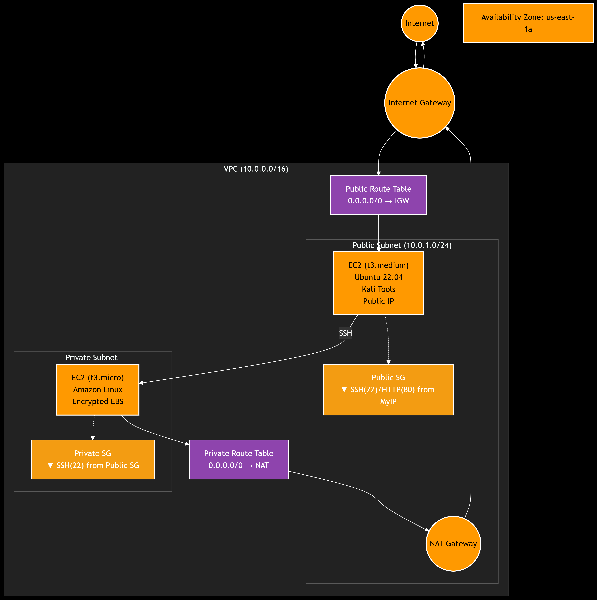

# AWS Cybersecurity Infrastructure with Terraform

This Terraform project creates a secure AWS infrastructure with a VPC containing public and private subnets, EC2 instances, and proper security groups. The public instance runs Ubuntu with comprehensive cybersecurity and penetration testing tools from Kali Linux.

## 📌 Architecture Overview



The infrastructure consists of:

- **VPC** with CIDR block `10.0.0.0/16`
- **Public Subnet** (`10.0.1.0/24`) containing:
  - Public EC2 instance running Ubuntu with Kali Linux tools
  - Internet Gateway for internet access
  - NAT Gateway for private subnet internet access
- **Private Subnet** (`10.0.2.0/24`) containing:
  - Private EC2 instance with encrypted EBS volume
  - Route table pointing to NAT Gateway
- **Security Groups**:
  - Public SG: Allows SSH (22) and HTTP (80) from your IP
  - Private SG: Allows SSH only from public subnet instances
- **SSH Key Pair**: Automatically generated and saved locally

## Pre-installed Security Tools

The public EC2 instance runs Ubuntu 22.04 LTS with a comprehensive suite of Kali Linux cybersecurity tools:

### Full Kali Linux Toolset
- **kali-linux-default** - Complete default Kali Linux toolset including:
  - Information gathering tools
  - Vulnerability analysis tools
  - Web application analysis tools
  - Database assessment tools
  - Password attacks tools
  - Wireless attacks tools
  - Exploitation tools
  - Sniffing & spoofing tools
  - Post exploitation tools
  - Forensics tools
  - Reporting tools
  - Social engineering tools

### Network Security Tools
- **Nmap** - Network discovery and security auditing
- **Netcat** - Network utility for reading/writing data across connections
- **Tcpdump** - Packet analyzer
- **Wireshark CLI** - Network protocol analyzer

### Penetration Testing Tools
- **Metasploit Framework** - Penetration testing platform
- **SQLMap** - SQL injection and database takeover tool
- **Nikto** - Web server scanner
- **Dirb** - Web content scanner

### Password Security Tools
- **John the Ripper** - Password cracking tool
- **Hashcat** - Advanced password recovery

### System and Network Utilities
- **SSH clients** - Secure shell utilities
- **Telnet/FTP** - Network protocols
- **DNS utilities** - dig, nslookup
- **System monitoring** - lsof, strace, ltrace

### Python Security Libraries
- **Requests** - HTTP library
- **BeautifulSoup4/LXML** - Web scraping
- **Paramiko** - SSH protocol implementation
- **Scapy** - Packet manipulation
- **Pwntools** - CTF framework and exploit development

### System Tools
- **Vim/Nano** - Text editors
- **Htop/Iotop** - System monitoring
- **Git** - Version control

## Project Structure

```
aws-cybersec/
├── main.tf                 # Main Terraform configuration
├── variables.tf            # Variable definitions
├── outputs.tf              # Output values
├── terraform.tfvars        # Variable values (customize this)
├── README.md               # This file
├── private_key.pem         # Generated SSH private key (after apply)
└── modules/
    ├── vpc/                # VPC module
    │   ├── main.tf
    │   ├── variables.tf
    │   └── outputs.tf
    ├── security_groups/    # Security groups module
    │   ├── main.tf
    │   ├── variables.tf
    │   └── outputs.tf
    └── ec2_instances/      # EC2 instances module
        ├── main.tf
        ├── variables.tf
        └── outputs.tf
```

## Prerequisites

1. **Terraform** (version >= 1.0)
2. **AWS CLI** configured with appropriate credentials
3. **Your IP Address** for security group configuration

## Setup Instructions

### 1. Configure AWS Credentials

```bash
aws configure
```

### 2. Update Configuration

Edit `terraform.tfvars` and update the following values:

```hcl
# Change to your actual IP address
my_ip_address = "YOUR_IP_ADDRESS/32"  # e.g., "203.0.113.0/32"
```

### 3. Initialize Terraform

```bash
terraform init
```

### 4. Review the Plan

```bash
terraform plan
```

### 5. Apply the Configuration

```bash
terraform apply
```

**Note**: This will automatically generate an SSH key pair and save the private key as `private_key.pem` in your project directory. The public instance will be configured with Ubuntu and Kali Linux tools during startup.

## Security Features

- **Network Isolation**: Private subnet instances are not directly accessible from the internet
- **Encrypted Storage**: Private instance has an encrypted EBS volume
- **Restricted Access**: Security groups limit access to specific IP ranges and instances
- **NAT Gateway**: Private instances can access the internet through the NAT Gateway
- **Auto-generated SSH Keys**: Secure RSA 4096-bit key pair generated automatically
- **Pre-installed Security Tools**: Complete Kali Linux toolset on Ubuntu

## Accessing Instances

### Public Instance (Ubuntu Security Tools Server)
- **SSH**: `ssh -i private_key.pem ubuntu@<public_instance_public_ip>`
- **HTTP**: `http://<public_instance_public_ip>` (shows server status)
- **Available Tools**: Full Kali Linux toolset is pre-installed and ready to use

### Private Instance
- **SSH**: First SSH to the public instance, then SSH to the private instance:
  ```bash
  ssh -i private_key.pem ubuntu@<public_instance_public_ip>
  ssh -i private_key.pem ec2-user@<private_instance_private_ip>
  ```

## Using the Security Tools

Once connected to the public instance, you can use any of the pre-installed Kali Linux tools:

```bash
# Network scanning
nmap -sS -sV <target_ip>

# Web application testing
sqlmap -u "http://target.com/vulnerable.php?id=1"

# Password cracking
john --wordlist=/usr/share/wordlists/rockyou.txt hash.txt

# Network monitoring
tcpdump -i eth0 -w capture.pcap

# Metasploit
msfconsole

# List all available Kali tools
dpkg -l | grep kali

# Check installed tools
ls /opt/security-tools/
cat /opt/security-tools/README.txt
```

## Outputs

After successful deployment, Terraform will output:

- VPC ID
- Subnet IDs
- Public instance public IP
- Private instance private IP
- NAT Gateway public IP
- Key pair name
- Private key file location

## Cost Considerations

- **NAT Gateway**: ~$0.045 per hour + data processing fees
- **EC2 Instances**: Depends on instance type (t3.micro is free tier eligible)
- **EBS Volumes**: ~$0.10 per GB-month
- **Data Transfer**: Standard AWS data transfer pricing

## Cleanup

To destroy all resources:

```bash
terraform destroy
```

**Note**: This will also delete the generated key pair from AWS, but the local `private_key.pem` file will remain.

## Security Best Practices

1. **Change Default Values**: Update `my_ip_address` to your actual IP
2. **Secure Key Storage**: The private key is automatically saved with proper permissions (0400)
3. **Regular Updates**: Keep instances updated with security patches
4. **Monitor Logs**: Enable CloudTrail and CloudWatch for monitoring
5. **Backup Strategy**: Implement regular backups for important data
6. **Key Management**: Keep the generated private key secure and don't share it
7. **Tool Usage**: Use security tools responsibly and only on systems you own or have permission to test

## Legal and Ethical Considerations

⚠️ **Important**: This infrastructure includes penetration testing tools. Please ensure:

- You only use these tools on systems you own or have explicit permission to test
- You comply with all applicable laws and regulations
- You follow responsible disclosure practices
- You obtain proper authorization before conducting security assessments

## Troubleshooting

### Common Issues

1. **Permission Denied**: Ensure the private key has correct permissions:
   ```bash
   chmod 400 private_key.pem
   ```
2. **IP Address Issues**: Verify your IP address is correctly formatted (CIDR notation)
3. **NAT Gateway Costs**: Be aware of NAT Gateway hourly charges
4. **Instance Connectivity**: Check security group rules if instances can't communicate
5. **Tool Installation**: If tools are missing, they may still be installing. Check with:
   ```bash
   ps aux | grep apt
   ```
6. **SSH Connection**: Use `ubuntu` as the username for the public instance:
   ```bash
   ssh -i private_key.pem ubuntu@<public_ip>
   ```

### Useful Commands

```bash
# Check Terraform state
terraform show

# List all resources
terraform state list

# Refresh state
terraform refresh

# Validate configuration
terraform validate

# Test SSH connection
ssh -i private_key.pem -o StrictHostKeyChecking=no ubuntu@<public_ip>

# Check installed tools on public instance
ls /opt/security-tools/
cat /opt/security-tools/README.txt

# Check Kali Linux tools installation
dpkg -l | grep kali
```

## Contributing

Feel free to submit issues and enhancement requests!

## License

This project is licensed under the MIT License. 